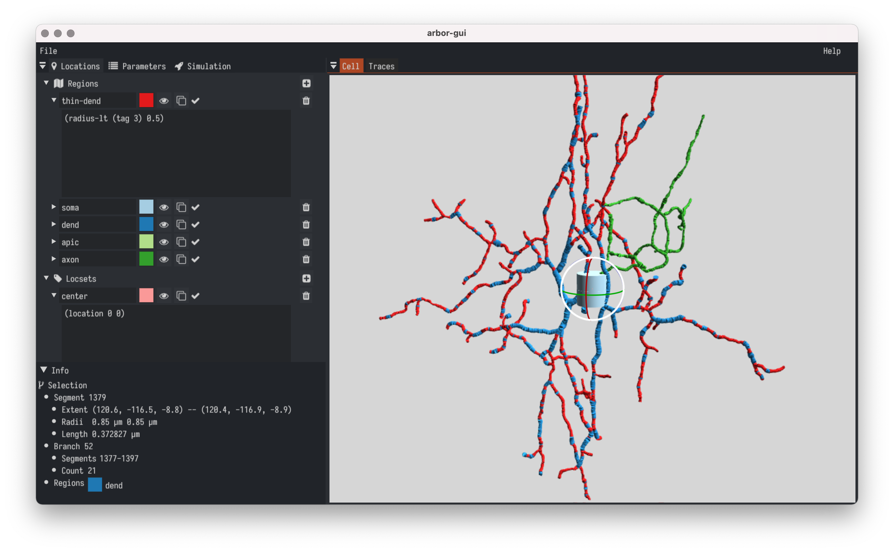
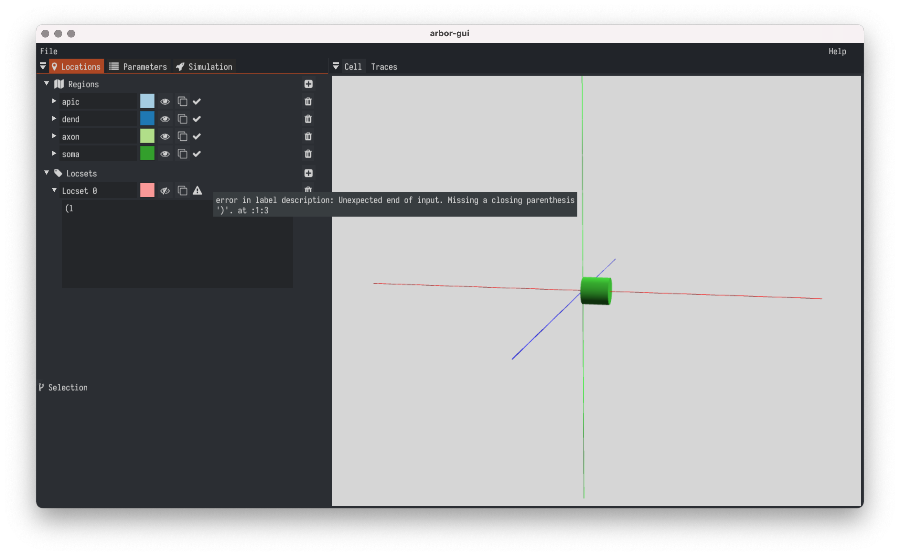
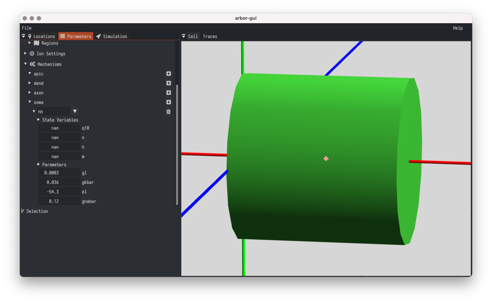
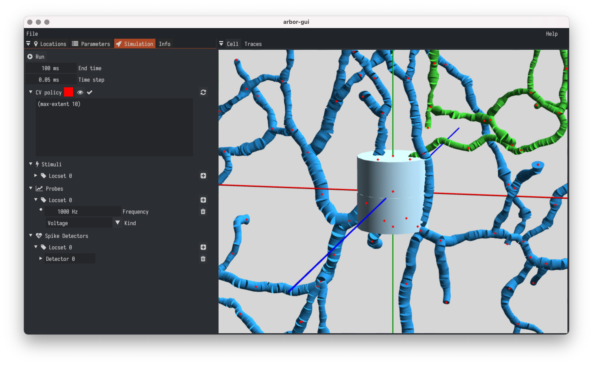

# Introduction



This project aims to be a comprehensive tool for building single cell
models using Arbor. It strives to be self-contained, fast, and easy to
use.

-   Design morphologically detailled cells for simulation in Arbor.
-   Load morphologies from SWC `.swc`, NeuroML `.nml`, NeuroLucida
    `.asc`.
-   Define and highlight Arbor regions and locsets.
-   Paint ion dynamics and bio-physical properties onto morphologies.
-   Place spike detectors and probes.
-   Export cable cells to Arbor\'s internal format (ACC) for direct
    simulation.
-   Import cable cells in ACC format

This project is under active development and welcomes early feedback.
Currently, Arbor master as of March 2021 is supported and bundled with
the project. Note that the screenshots below are updated less frequently
than the actual project. We aim for a formal release with Arbor 0.6 at
which point the project will stabilise and receive regular updates
alongside Arbor.

We welcome bug reports and feature requests, please use the issue
tracker here on GitHub for these purposes. Building network simulation
is out of scope for this project (we might offer a different tool,
though).

## Interactive Definition of Regions and Locsets



-   Rendering of cable cell as seen by Arbor.
-   Define locations in Arbor\'s Locset/Region DSL.
    -   Live feedback by Arbor\'s parser.
    -   Well-formed expressions are rendered immediately.
-   Navigate with
    -   pan: arrow keys or hold [CTRL],
    -   zoom: +/- or mouse wheel,
    -   rotate: hold [SHIFT].
-   Right-click to
    -   reset camera,
    -   snap-to a defined locset,
    -   set the background colour,
    -   tweak morphology orientation,
    -   toggle orientation guide,
    -   save the currently rendered image to disk.
    -   enter auto-rotation mode
-   Hover a segment to show
    -   containing branch and regions,
    -   geometry information.

## Definition of Ion Dynamics



-   Load mechanisms from built-in catalogues.
-   Define ion species.
-   Set parameters of mechanisms and ions.
-   Set global and cell level defaults.

## Manipulation of Cable Cell Parameters


-   Set per-region parameters like temperature, resisitivities, and
    more.
-   Set global and cell level defaults.

## Simulation Interface



-   Timestep and simulation interval.
-   Add Probes, Stimuli, and Spike Detectors.
-   Set and visualise discretisation policy.
-   Run a preview simulation and see probed traces.

# Notes

-   You can adjust the GUI layout by dragging and dropping windows and
    tabs.
-   Dragging regions will change rendering order, so overlapping regions
    might be better visible.
-   The Arbor GUI vendors its own copy of Arbor.

# Installation

We have Apple Disk Images and Linux AppImages which are the preferred way
of getting and using Arbor GUI. Simply download the version for your
system and copy them to a directory of your choosing.

The Arbor GUI requires a functional OpenGL 3.3+ package and recent (as
in C++20 supported) C++ compiler to be present on the system. Listed
below are the standard instructions to install per platform. Mileage may
vary, especially when installing OpenGL. You might need to update
drivers, or have to execute other environment specific patches.

## Building Arbor GUI

If you wish to build and perhaps modify Arbor GUI, start out by cloning
the repository and creating a build directory:

```bash
git clone --recursive https://github.com/thorstenhater/arbor-gui.git
cd arbor-gui
mkdir build
cd build
```
Next, follow the platform specific instructions.

## Linux (Ubuntu)

1.  Install build dependencies
    ``` bash
    sudo apt update
    sudo apt install libxml2-dev libxrandr-dev libxinerama-dev \
                     libxcursor-dev libxi-dev libglu1-mesa-dev \
                     freeglut3-dev mesa-common-dev gcc-10 g++-10
    ```
2.  Add GCC10 as alternative to GCC and select it:
    ``` bash
    sudo update-alternatives --install /usr/bin/gcc gcc /usr/bin/gcc-10 10
    sudo update-alternatives --install /usr/bin/g++ g++ /usr/bin/g++-10 10
    ```
    Use `gcc --version` to confirm it is now version 10. If not you will
    need to run `sudo update-alternatives --config gcc` (and its analog for
    `g++`) and manually select the right number.

3.  Install Arbor GUI
    ```bash
    cmake ..
    sudo make install -j 4
    ```

## Windows (WSL2)

Users of Windows Subsystem for Linux will have to run an X-Server on
their Windows machine and use X11-forwarding to display the GUI.

1.  Install [VcXsrv](https://sourceforge.net/projects/vcxsrv/).
    Make sure you add the right firewall rules and a subnet mask for the
    incoming connections.
    [This](https://github.com/cascadium/wsl-windows-toolbar-launcher#firewall-rules)
    is a great write-up of all the pitfalls you can encounter.

2.  Add the following to `.bashrc`. Please note that it is similar
    but not identical to snippets you\'ll find elsewhere:
    ```bash
    export DISPLAY=$(awk '/nameserver / {print $2; exit}' /etc/resolv.conf 2\>/dev/null):0
    export LIBGL_ALWAYS_INDIRECT=0
    export MESA_GL_VERSION_OVERRIDE=3.3 # This should no longer be needed.
    ```

## MacOS

Please use a recent version of Clang, as installed by brew for example.
The project has been confirmed to build and run with Clang 11 on BigSur
and Catalina using this line

```bash
cmake .. -DCMAKE_CXX_COMPILER=/usr/local/opt/llvm/bin/clang++ \
         -DCMAKE_C_COMPILER=/usr/local/opt/llvm/bin/clang     \
         -DCMAKE_BUILD_TYPE=release
```
# Acknowledgements

This project uses various open source projects, licensed under
permissive open source licenses. See the respective projects for license
and copyright details.

-   Arbor: <https://github.com/arbor-sim/arbor>
-   GLM for OpenGL maths: <https://github.com/g-truc/glm>
-   GLFW for setting up windows: <https://github.com/glfw/glfw>
-   Dear ImGUI library <https://github.com/ocornut/imgui>
-   Iosevka font <https://github.com/be5invis/Iosevka>
-   ForkAwesome icon set <https://github.com/ForkAwesome/Fork-Awesome>
-   C++ icon bindings <https://github.com/juliettef/IconFontCppHeaders>
-   fmt formatting <https://github.com/fmtlib/fmt>
-   spdlog logger <https://github.com/gabime/spdlog>
-   stb image loader <https://github.com/nothings/stb>
-   Tracy profiler <https://github.com/wolfpld/tracy.git>

Test and example datasets include:

-   A morphology model `dend-C060114A2_axon-C060114A5.asc` copyright of
    the BBP, licensed under the [CC BY-NC-SA 4.0
    license](https://creativecommons.org/licenses/by-nc-sa/4.0/).
